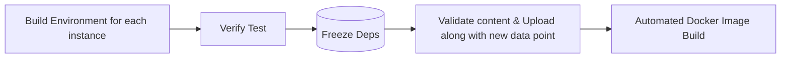
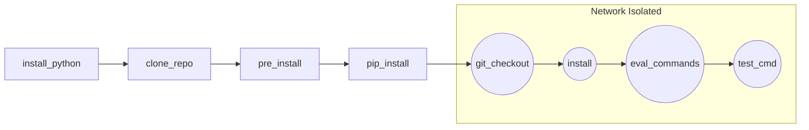

### Initial Setup
> [!IMPORTANT]
> It is **REQUIRED** to run both the project setup/tests & the evaluation harness in a Devcontainer that has docker-in-docker installed (use the provided devcontainer in the SWE-bench repository. [Guide to use here.](https://github.com/PGCodeLLM/.devcontainer) This is required to avoid clashes between Docker containers when multiple people are running evaluation harness on the same system, and is crucial for reproducibility of the instance images.
> Any missing system-level dependencies that are specific to the project build/test should also be included in the final TestSpec. The Devcontainer is intentionally shredded-down to keep images small.

> [!IMPORTANT]
> Each new project data instance should be verified inside a clean UV virtual environment (inside devcontainer run: `uv venv <project_venv_name> --python <3.xx.x | 3.xx> --seed && source <project_venv_name>/bin/activate`). [UV](https://docs.astral.sh/uv/) is 10x-100x faster than pip, and is preinstalled for you in the Devcontainer system-wide. You should prefer `uv pip` instead of `pip` to enjoy the benefits (`alias pip=uv pip`).

## Step-by-step Example (httpx project)

### Files you will need

You will need the following files that will be evaluated with the SWE-bench evaluation harness. These must be generated separately

- `httpx_data.jsonl`
    - Data file in SWE-Bench format that contains issues from `httpx` project. Needs to contain lists of FTP (fail-to-pass) and PTP (pass-to-pass) tests for each issue.
- Installation and test instructions for the project version which you want to test (needed for test spec generation)

> [!CAUTION]
> We have implemented a new protocol, to enable frozen & reproducible automatic Docker image builds
> Currently, we require an additional frozen requirements.txt to be submitted along with the data PRs into this repository

**Here's a detailed guide on how to do it before you proceed further.**

Overview of what's expected in the new protocol:



To do this, after you figure out the way to build the project, and have verify the tests in the **DevContainer**, inside of a **clean** VirtualEnv:

1. **Freeze Dependencies**
   - **Inside** the virtual environment, execute:
     ```bash
     # We explicitly use uv here because it prevents using the wrong pip
     uv pip list --format=freeze --exclude-editable > requirements_frozen_<repo>_<version>.txt
     ```
   - This will generate a frozen list of installed dependencies, enabling reproducibility.

2. **Validate & Upload**
   - Validate the generated `requirements_frozen_instance_id.txt` to ensure it contains the expected dependencies. (no extra @files, no accidental inclusions)
   - Upload the file along with the new data point PR, into the `/swebench/harness/constants/custom_frozen_requirements` folder as a plain text file.

## 0. Install
```bash
cd MindForge
make install-harness
```
or install with pip
```
pip install -e .
```
Note: The evaluation environments can but run with pip but the verification env must install with uv to ensure the requirements can be correctly frozen.
> warning
> You need to re-install the harness whenever a code change happens unless you are not running the harness under the __mindforge_harness__ directory.
## 1.Evaluation
`cd mindforge_harness`

### 1.2 Run Gold Patch Tests

```bash
python -m mindforge_harness.main \
    --predictions_path gold \
    --max_workers 1 \
    --mode evaluate \
    --dataset_name total.jsonl \
    --instance_ids id1 id2
```
To use huggingface datasets
```bash
python -m mindforge_harness.main \
    --predictions_path gold \
    --max_workers 1 \
    --mode evaluate \
    --dataset_name princeton-nlp/SWE-bench_Verified \
    --instance_ids id1 id2
```
### 1.2 Run Custom Patch Tests

See help
```bash
python -m mindforge_harness.main -h
```

## 2.Docker Build and Run Procedure

### 3. Add project-specific installation and test instructions (test spec) to original data at `spec_dict`
Defines command for running tests; these are often general commands (without specifying specific test) that will work on wide range of project versions. Example a data points after add spec dict:
```json
{
  "instance_id": "encode__httpx-2701",
  "repo": "encode/httpx",
  "pull_number": 2701,
  "issue_numbers": [
    "2694"
  ],
  "base_commit": "df5dbc05580a4c3225e70153729e2a306d67a472",
  "patch": "diff --git a/httpx/_urlparse.py b/httpx/_urlparse.py\n--- a/httpx/_urlparse.py\n+++ b/httpx/_urlparse.py\n@@ -253,12 +253,19 @@ def urlparse(url: str = \"\", **kwargs: typing.Optional[str]) -> ParseResult:\n     if has_authority:\n         path = normalize_path(path)\n \n-    parsed_path: str = quote(path, safe=SUB_DELIMS + \":@/\")\n+    # The GEN_DELIMS set is... : / ? # [ ] @\n+    # These do not need to be percent-quoted unless they serve as delimiters for the\n+    # specific component.\n+\n+    # For 'path' we need to drop ? and # from the GEN_DELIMS set.\n+    parsed_path: str = quote(path, safe=SUB_DELIMS + \":/[]@\")\n+    # For 'query' we need to drop '#' from the GEN_DELIMS set.\n     parsed_query: typing.Optional[str] = (\n-        None if query is None else quote(query, safe=SUB_DELIMS + \"/?\")\n+        None if query is None else quote(query, safe=SUB_DELIMS + \":/?[]@\")\n     )\n+    # For 'fragment' we can include all of the GEN_DELIMS set.\n     parsed_fragment: typing.Optional[str] = (\n-        None if fragment is None else quote(fragment, safe=SUB_DELIMS + \"/?\")\n+        None if fragment is None else quote(fragment, safe=SUB_DELIMS + \":/?#[]@\")\n     )\n \n     # The parsed ASCII bytestrings are our canonical form.\n",
  "test_patch": "diff --git a/tests/test_urlparse.py b/tests/test_urlparse.py\n--- a/tests/test_urlparse.py\n+++ b/tests/test_urlparse.py\n@@ -247,3 +247,33 @@ def test_copy_with():\n \n     url = url.copy_with(path=\"/abc\")\n     assert str(url) == \"http://example.com/abc\"\n+\n+\n+# Tests for percent encoding across path, query, and fragement...\n+\n+\n+def test_path_percent_encoding():\n+    # Test percent encoding for SUB_DELIMS ALPHA NUM and allowable GEN_DELIMS\n+    url = httpx.URL(\"https://example.com/!$&'()*+,;= abc ABC 123 :/[]@\")\n+    assert url.raw_path == b\"/!$&'()*+,;=%20abc%20ABC%20123%20:/[]@\"\n+    assert url.path == \"/!$&'()*+,;= abc ABC 123 :/[]@\"\n+    assert url.query == b\"\"\n+    assert url.fragment == \"\"\n+\n+\n+def test_query_percent_encoding():\n+    # Test percent encoding for SUB_DELIMS ALPHA NUM and allowable GEN_DELIMS\n+    url = httpx.URL(\"https://example.com/?!$&'()*+,;= abc ABC 123 :/[]@\" + \"?\")\n+    assert url.raw_path == b\"/?!$&'()*+,;=%20abc%20ABC%20123%20:/[]@?\"\n+    assert url.path == \"/\"\n+    assert url.query == b\"!$&'()*+,;=%20abc%20ABC%20123%20:/[]@?\"\n+    assert url.fragment == \"\"\n+\n+\n+def test_fragment_percent_encoding():\n+    # Test percent encoding for SUB_DELIMS ALPHA NUM and allowable GEN_DELIMS\n+    url = httpx.URL(\"https://example.com/#!$&'()*+,;= abc ABC 123 :/[]@\" + \"?#\")\n+    assert url.raw_path == b\"/\"\n+    assert url.path == \"/\"\n+    assert url.query == b\"\"\n+    assert url.fragment == \"!$&'()*+,;= abc ABC 123 :/[]@?#\"\n",
  "problem_statement": "Square brackets no longer work\nA GET request such as `/?arr[]=1&arr[]=2` is perfectly legal and it means that you are trying to send an array of values to the endpoint.\r\n\r\nUnluckily after 0.23.3 it stopped working because requests are sent as `/?arr%5B%5D=1&arr%5B%5D=2`\r\n\r\n\r\n\r\n\n",
  "hints_text": "hrm... my reading of RFC 3986 is that square brackets *do* need escaping in the path component.\r\n\r\nSee https://www.rfc-editor.org/rfc/rfc3986#section-3.3\r\n\r\n```\r\npchar         = unreserved / pct-encoded / sub-delims / \":\" / \"@\"\r\n```\r\n\r\nAnd...\r\n\r\nhttps://www.rfc-editor.org/rfc/rfc3986#section-2.2\r\n\r\n```\r\n      reserved    = gen-delims / sub-delims\r\n\r\n      gen-delims  = \":\" / \"/\" / \"?\" / \"#\" / \"[\" / \"]\" / \"@\"\r\n\r\n      sub-delims  = \"!\" / \"$\" / \"&\" / \"'\" / \"(\" / \")\"\r\n                  / \"*\" / \"+\" / \",\" / \";\" / \"=\"\r\n```\r\n\r\nThe condensed https://www.rfc-editor.org/rfc/rfc3986#appendix-A is helpful there.\r\n\r\nAm I reading this wrong?\r\n\r\nHowever, I can see that chrome does *not* percent-escape square brackets in the path. Perhaps the browser behaviour differs from the RFC spec?\r\n\r\n\nYou are actually right, this is poorly documented and looks like sending non escaped square brackets is a standard de facto. \r\n\r\nThe ugly solution would be to add a `strict` parameter, it's definitely breaking something that used to work in the past :) \r\n\r\n\r\n\nIf browser behaviour doesn't match the spec here, then I'm okay with `httpx` switching to that.\n\nA pull request adding them to the unescaped sequences, along with a code comment would be okay.",
  "created_at": 1683628445000,
  "PASS_TO_PASS": [
    "tests/test_urlparse.py::test_urlparse_invalid_ipv6",
    "tests/test_urlparse.py::test_urlparse",
    "tests/test_urlparse.py::test_urlparse_with_invalid_component",
    "tests/test_urlparse.py::test_param_does_not_require_encoding",
    "tests/test_urlparse.py::test_urlparse_with_components",
    "tests/test_urlparse.py::test_urlparse_no_scheme",
    "tests/test_urlparse.py::test_urlparse_with_relative_path",
    "tests/test_urlparse.py::test_urlparse_valid_ipv6",
    "tests/test_urlparse.py::test_urlparse_normalized_path",
    "tests/test_urlparse.py::test_urlparse_with_invalid_scheme",
    "tests/test_urlparse.py::test_fragment_percent_encoding",
    "tests/test_urlparse.py::test_urlparse_leading_dot_prefix_on_absolute_url",
    "tests/test_urlparse.py::test_urlparse_excessively_long_url",
    "tests/test_urlparse.py::test_urlparse_invalid_ipv4",
    "tests/test_urlparse.py::test_urlparse_leading_dot_prefix_on_relative_url",
    "tests/test_urlparse.py::test_urlparse_escaped_path",
    "tests/test_urlparse.py::test_urlparse_valid_host",
    "tests/test_urlparse.py::test_urlparse_invalid_port",
    "tests/test_urlparse.py::test_urlparse_valid_ipv4",
    "tests/test_urlparse.py::test_urlparse_escaped_idna_host",
    "tests/test_urlparse.py::test_urlparse_non_printing_character_in_component",
    "tests/test_urlparse.py::test_urlparse_excessively_long_component",
    "tests/test_urlparse.py::test_urlparse_non_printing_character_in_url",
    "tests/test_urlparse.py::test_urlparse_normalized_port",
    "tests/test_urlparse.py::test_param_requires_encoding",
    "tests/test_urlparse.py::test_urlparse_valid_port",
    "tests/test_urlparse.py::test_urlparse_with_invalid_path",
    "tests/test_urlparse.py::test_param_with_existing_escape_requires_encoding",
    "tests/test_urlparse.py::test_urlparse_invalid_idna_host",
    "tests/test_urlparse.py::test_urlparse_normalized_host",
    "tests/test_urlparse.py::test_urlparse_unescaped_idna_host",
    "tests/test_urlparse.py::test_urlparse_no_authority",
    "tests/test_urlparse.py::test_copy_with"
  ],
  "FAIL_TO_PASS": [
    "tests/test_urlparse.py::test_query_percent_encoding",
    "tests/test_urlparse.py::test_path_percent_encoding"
  ],
  "FAIL_TO_FAIL": [],
  "note": -1,
  "version": "default", //depreciate and use spec_dict
  "task_score": -1,
  "evaluation_score": -1,
  "difficulty_score": -1,
  "spec_dict": {
    "python": "3.9",
    "pip_packages": [
      "rfc3986[idna2008]<2,>=1.3",
      "httpcore<0.15.0,>=0.14.5",
      "socksio==1.*",
      "h2<5,>=3",
      "rich<13,>=10",
      "hpack<5,>=4.1",
      "hyperframe<7,>=6.1",
      "anyio==3.*",
      "h11<0.13,>=0.11",
      "commonmark<0.10.0,>=0.9.0",
      "hstspreload",
      "brotli",
      "pytest-cov",
      "chardet==5.0.0",
      "types-chardet==5.0.3",
      "mkdocs==1.4.0",
      "mkautodoc==0.2.0",
      "mkdocs-material==8.5.5",
      "build==0.8.0",
      "twine==4.0.1",
      "autoflake==1.4",
      "black==22.8.0",
      "coverage==6.4.4",
      "cryptography==38.0.1",
      "flake8==3.9.2",
      "flake8-bugbear==22.7.1",
      "importlib-metadata==4.13.0",
      "isort==5.10.1",
      "mypy==0.971",
      "types-certifi==2021.10.8.2",
      "pytest==7.1.2",
      "pytest-asyncio==0.19.0",
      "pytest-trio==0.7.0",
      "trio==0.21.0",
      "trio-typing==0.7.0",
      "trustme==0.9.0",
      "uvicorn==0.18.3"
    ],
    "install": "pip install -e .[brotli,cli,http2,socks,zstd]",
    "test_cmd": "pytest --tb=short --json-report --json-report-file=/pass_report.json -W ignore::DeprecationWarning"
  }
}
```


Detailed explanation of every possible field in the test spec schema:
```json
{  // JSON Schema, you should fill in the blanks but not all fields needs to be filled unless it's necessary!
  "python": "string (Python version required for the environment)",
  "packages": "", // LEAVE EMPTY DUE TO FROZEN REQ
  "pre_install": "list of strings (Shell commands to execute before installation, e.g., package manager updates, system settings changes)",
  "install": "normally empty or pip install .", // LEAVE EMPTY unless the project needs compiling or special installation steps 
  "pip_packages": "",  // LEAVE EMPTY DUE TO FROZEN REQ
  "test_cmd": "string (The Generic Command used to run tests)",
  "eval_commands": "list of strings (Shell commands for setting environment variables or system configurations before evaluation start)",
  "version": "The environment version that is used to load the frozen environments."
}
```
## Produce Mode
`--mode produce` is for generating Fail-To-Pass and Pass-To-Pass tests for each instance, before running the harness with `--mode produce`, you should ensure the version field in the dataset i.e. "default", "<repo>_v1" etc... are consistent with the _keys_ of the custom_python.py SPEC dicts, then add the spec_dict or use the already spec in `mindforge_harness/mindforge_harness/hardcode/custom_python.py`.
Example with build in spec (Recommand)
Please add freeze spec dict to data before run
```bash
python -m mindforge_harness.main \
    --predictions_path gold \
    --max_workers 20 \
    --mode produce \
    --dataset_name /home/zhilong/pgcodellm-rl-data/checked_with_mindforge_harness/blue_zone_verified/pydantic_resolved_for_eval.jsonl
```

Example with spec_dict (Depreciate)
```bash
python -m mindforge_harness.main \
    --predictions_path gold \
    --max_workers 20 \
    --mode produce \
    --dataset_name /home/zhilong/pgcodellm-rl-data/checked_with_mindforge_harness/blue_zone_verified/pydantic_resolved_for_eval.jsonl \
    --spec_dict '{"default": {"python": "3.9", "install": "", "pip_packages": ["Cython==0.29.21;sys_platform!= '\''win32'\''", "devtools==0.6.1", "email-validator==1.1.2", "dataclasses", "typing-extensions", "python-dotenv==0.15.0", "pydantic_core", "annotated-types>=0.4.0"], "test_cmd": "pytest --tb=short --json-report --json-report-file=/pass_report.json -W ignore::DeprecationWarning"}}'
```

After run, the data with right Fail-To-Pass will be filtered and stored in `produced_dataset.jsonl`.
> [!CAUTION]
> If you have supplied a `--spec_dict` flag, then it will overload the original spec_dict in the custom_python.py. As such, you must supply all dependences in "pip_packages", as Mindforge Harness will not read from the frozen dependency file.

## Uploading successful images to MindForge Registry 
To save time and bandwidth, we can upload previously built images to a registry, without rebuilding/pip installing dependencies. These images can be downloaded directly, and be used for online evaluation during the RL update step, where each repo/ instance is in a state prior to code patch application, so the LLM generate patch can be applied and pytest command run to determine if it is able to solve the instance.

To enable this, append the `--push_to_registry true` and `--registry_url <DOCKER REGISTRY>` arguments to the normal `mindforge_harness.main` command:
```bash
# 1. Built on blue/fast network machine
python -m mindforge_harness.main \
    --predictions_path gold \
    --max_workers 1 \
    --mode evaluate \
    --dataset_name total.jsonl \
    --push_to_registry \
    --registry_url 202.78.161.211:5000 \
    --registry_user bmc \
    --registry_pass xxxxx

# 2. Evaluated on green/slow network machine
python -m mindforge_harness.main \
    --predictions_path gold \
    --max_workers 1 \
    --mode evaluate \
    --dataset_name total.jsonl \
    --pull_from_registry \
    --registry_url 202.78.161.211:5000 \
    --registry_user bmc \
    --registry_pass xxxxx
```

Alternatively, export `MF_PUSH_TO_REGISTRY` and `MF_REGISTRY_URL` prior to invoking `mindforge_harness.main`
```bash
# 1. Built on blue/fast network machine
export MF_PUSH_TO_REGISTRY=True
export MF_REGISTRY_URL="202.78.161.211:5000"
export MF_REGISTRY_USER="bmc"
export MF_REGISTRY_PASS="xxxxx"

# 2. Evaluated on green/slow network machine
export MF_PULL_FROM_REGISTRY=True
export MF_REGISTRY_URL="202.78.161.211:5000"
export MF_REGISTRY_USER="bmc"
export MF_REGISTRY_PASS="xxxxx"
```

If image push step throws cert error, try adding it as an insecure registry:
```bash
# Add this to your Docker daemon config (requires restart)
echo '{"insecure-registries": ["202.78.161.211:5000"]}' | sudo tee /etc/docker/daemon.json
sudo systemctl restart docker

# In DinD, systemctl is not used, so kill and restart dockerd
killall dockerd && dockerd&
```

### Docker Hub
> [!CAUTION]
> DockerHub and the custom registry use different authentication methods, so pulling and pushing images work differently.
> Simplely unset `MF_REGISTRY_URL` or leave the `--registry_url` field to blank to enable pulling/pushing to dockerhub.
